<!-- ============ HERO / CASTLE HEADER ============ -->

  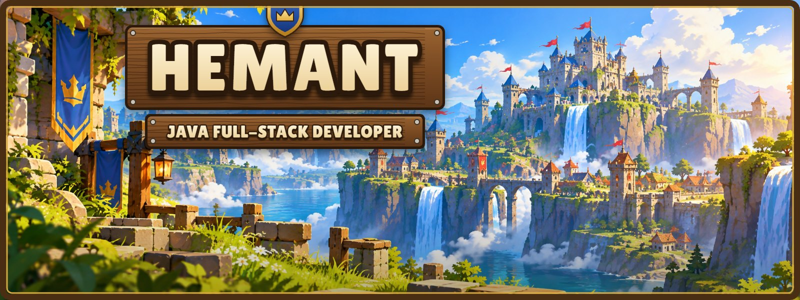
   
  
  
  <a href="https://www.linkedin.com/in/hemant-kumar-mahto-872b5334b/">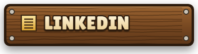</a>
  <a href="mailto:hemantmahto658@gmail.com">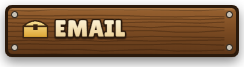</a>
   
  <a href="https://portfolio-1-psi-lemon.vercel.app/Hero%20Scroll.dc.html">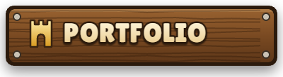</a>
  <a href="https://leetcode.com/u/HemantDWint/">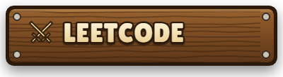</a>

 

<!-- ============ PLAYER / ABOUT ME ============ -->
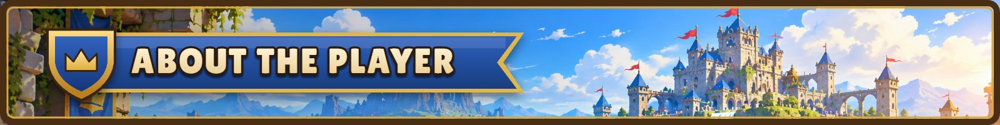

<table>
  <tr>
    <td width="34%" align="center" valign="middle">
      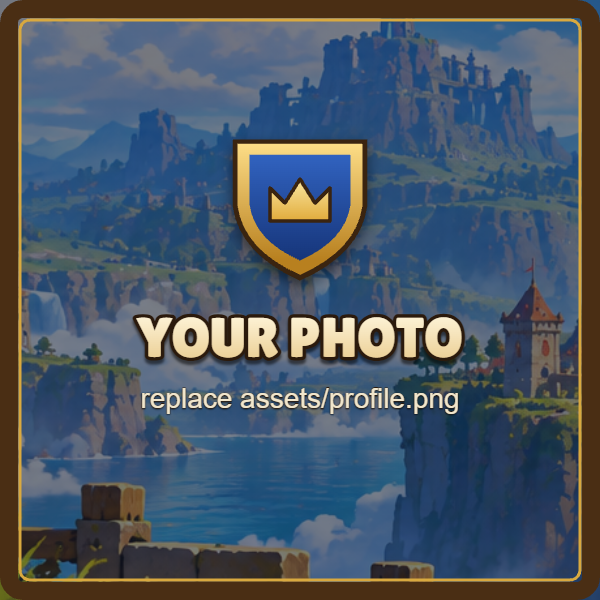
       
      <b>PLAYER&nbsp;·&nbsp;HEMANT</b>
    </td>
    <td width="66%" valign="middle">
      <h3>🏰 Welcome to my village, traveller.</h3>
      
I'm <b>Hemant Kumar Mahto</b>, a <b>Java full-stack builder</b> from Bengaluru, currently a Tech Intern at <b>Futurense Technologies</b>.

      

        ⚔️ I build backend and full-stack applications with <b>Java</b> and <b>Spring Boot</b>. 
        🧩 I sharpen my skills on DSA problems every week. 
        🔮 I build AI systems with <b>RAG</b>, <b>LLMs</b> and <b>FastAPI</b>, and explore <b>Cloud</b>. 
        📜 I keep learning new technologies and leveling up.
      

    </td>
  </tr>
</table>

 

<!-- ============ PLAYER STATS ============ -->
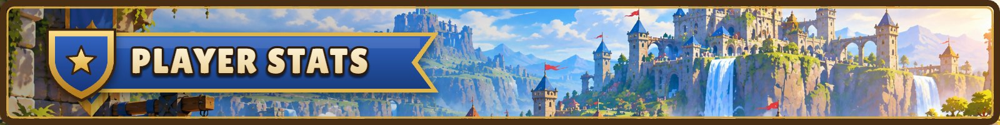

<table>
  <tr>
    <td width="25%" align="center">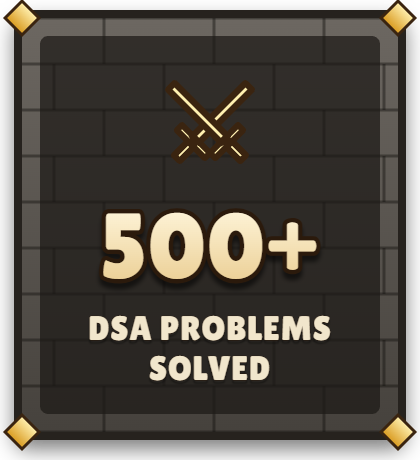</td>
    <td width="25%" align="center">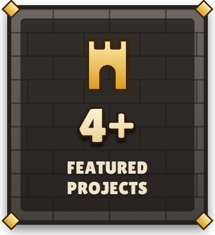</td>
    <td width="25%" align="center">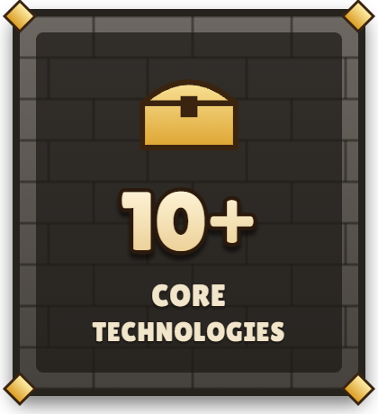</td>
    <td width="25%" align="center">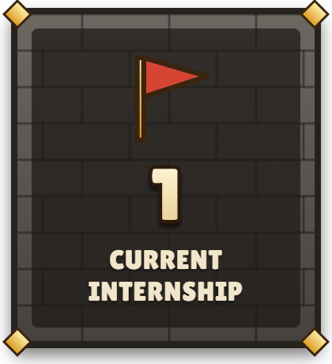</td>
  </tr>
</table>

 

<!-- ============ BASE INFO ============ -->
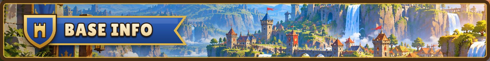

<table>
  <tr><th align="left" width="34%">🛡️ MAIN CLASS</th><td>Java Full-Stack Developer</td></tr>
  <tr><th align="left">📍 LOCATION</th><td>Bengaluru, India</td></tr>
  <tr><th align="left">📜 CURRENT QUEST</th><td>Tech Intern at Futurense Technologies (07/2026 – 10/2026)</td></tr>
  <tr><th align="left">⚔️ DSA LEVEL</th><td>500+ Problems</td></tr>
  <tr><th align="left">🎓 GUILD HALL</th><td>MCA, Amity University (8.6 CGPA)</td></tr>
  <tr><th align="left">🎯 CURRENT FOCUS</th><td>Spring Boot + System Design + AI</td></tr>
</table>

 

<!-- ============ TECH INVENTORY ============ -->
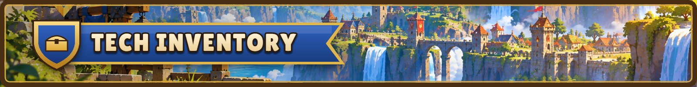

<table>
  <tr>
    <th align="left" width="24%">🗡️ Backend</th>
    <td width="36%"></td>
    <td><code>Java</code> <code>Spring Boot</code> <code>Spring Security</code> <code>Hibernate</code> <code>JPA</code> <code>REST APIs</code> <code>JWT</code> <code>Maven</code></td>
  </tr>
  <tr>
    <th align="left">💎 Database</th>
    <td></td>
    <td><code>MySQL</code> <code>PostgreSQL</code> <code>Redis</code></td>
  </tr>
  <tr>
    <th align="left">🔗 Distributed Systems</th>
    <td></td>
    <td><code>Kafka</code></td>
  </tr>
  <tr>
    <th align="left">🏹 Frontend</th>
    <td></td>
    <td><code>React</code> <code>JavaScript</code> <code>HTML</code> <code>CSS</code></td>
  </tr>
  <tr>
    <th align="left">📱 Mobile</th>
    <td></td>
    <td><code>Flutter</code> <code>Kotlin</code> <code>Android Studio</code></td>
  </tr>
  <tr>
    <th align="left">☁️ Cloud / DevOps</th>
    <td></td>
    <td><code>Docker</code> <code>AWS</code></td>
  </tr>
  <tr>
    <th align="left">🔮 AI</th>
    <td></td>
    <td><code>Python</code> <code>FastAPI</code> <code>RAG</code> <code>Gemini API</code> <code>FAISS</code> <code>pgvector</code> <code>Reinforcement Learning</code> <code>LLM / AI Engineering</code></td>
  </tr>
</table>

 

<!-- ============ FEATURED QUESTS / PROJECTS ============ -->
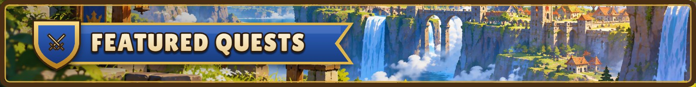

<table>
  <tr>
    <td width="50%" valign="top">
      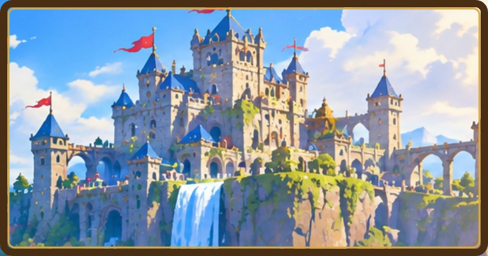
      <h3>🛒 E-Commerce Backend</h3>
      
Scalable Spring Boot backend with JWT auth, role-based access, and REST APIs for catalog, cart, orders and payments.

      
<code>Java</code> <code>Spring Boot</code> <code>Spring Security</code> <code>JPA</code> <code>MySQL</code>

      
<a href="https://github.com/hemantwint-hey/ecommerce-management-system">📂 Repository</a>

    </td>
    <td width="50%" valign="top">
      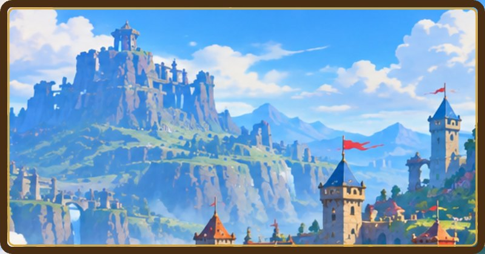
      <h3>🧠 Intelligent Decision System</h3>
      
Q-learning agent enhanced with RAG retrieval (FAISS) and Gemini reasoning, with a UI to compare decision modules.

      
<code>React</code> <code>Flask</code> <code>FAISS</code> <code>Gemini API</code> <code>Docker</code>

      
<a href="https://github.com/hemantwint-hey/Ml-model-with-Rl">📂 Repository</a>

    </td>
  </tr>
  <tr>
    <td width="50%" valign="top">
      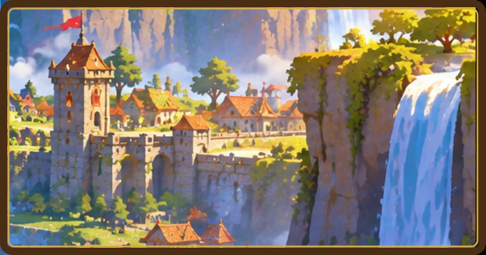
      <h3>🤖 AI Interview Question Pipeline</h3>
      
Automated research → RAG → generation → validation pipeline improving interview questions for 1,000+ students. Built at Futurense.

      
<code>Python</code> <code>FastAPI</code> <code>PostgreSQL</code> <code>RAG</code> <code>LLMs</code>

      
🔒 Internship work · private

    </td>
    <td width="50%" valign="top">
      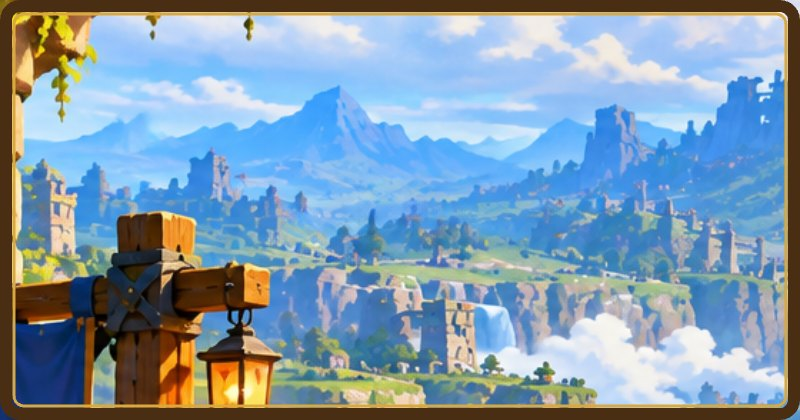
      <h3>🔄 HotSync</h3>
      
Syncs SharePoint Lists with Microsoft SQL Server using certificate-based Azure authentication. Built at 366PI.

      
<code>SharePoint</code> <code>MS SQL</code> <code>Azure</code>

      
<a href="https://github.com/hemantwint-hey/HotSync">📂 Repository</a>

    </td>
  </tr>
</table>

<b>🗺️ Side quests:</b> 🏰 Hostel &amp; Mess Finder · ⚔️ Enterprise Digital Banking · 🎯 FocusFlow

 

<!-- ============ ADVENTURE LOG ============ -->
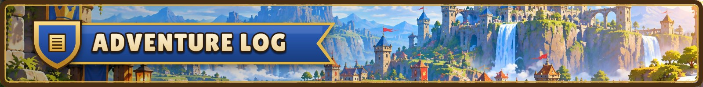

<table>
  <tr>
    <th align="left" width="30%">📜 Futurense Technologies Tech Intern · 07/2026 – 10/2026 · Bengaluru</th>
    <td>Automated the end-to-end AI interview question pipeline (research, web extraction, LLM synthesis, RAG, validation, deduplication, persistence) for 1,000+ students. Redesigned the Python/FastAPI backend with PostgreSQL and RAG services, and added quality controls: freshness and relevance checks, semantic deduplication, retries, and cost/quota limits.</td>
  </tr>
  <tr>
    <th align="left">📜 366PI Web Application Intern · 6 weeks</th>
    <td>Built HotSync to synchronize SharePoint Lists with Microsoft SQL Server, configured certificate-based Azure authentication, and deployed the Windmill Automation App review to staging.</td>
  </tr>
  <tr>
    <th align="left">🎓 Amity University, Jharkhand MCA · 09/2024 – 07/2026</th>
    <td>8.6 CGPA</td>
  </tr>
  <tr>
    <th align="left">🎓 Marwari College, Ranchi BCA · 2021 – 2024</th>
    <td>8.40 CGPA</td>
  </tr>
</table>

 

<!-- ============ GUILD ACTIVITY (live data) ============ -->
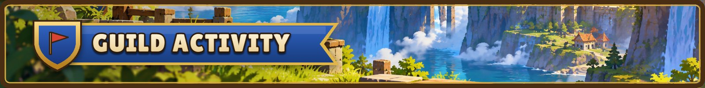

  

<table>
  <tr>
    <td width="50%" align="center">
      
    </td>
    <td width="50%" align="center">
      
    </td>
  </tr>
</table>

  
  

 

<!-- ============ CURRENT QUESTS ============ -->
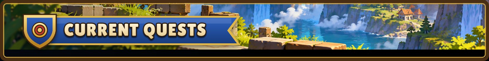

<table>
  <tr><th align="left" width="18%">QUEST I</th><td>☐ Improve DSA and reach 2000 Codeforces rating</td></tr>
  <tr><th align="left">QUEST II</th><td>☐ Master Spring Boot and System Design</td></tr>
  <tr><th align="left">QUEST III</th><td>☐ Build impactful production-level projects</td></tr>
  <tr><th align="left">QUEST IV</th><td>☐ Explore AI / ML and Cloud</td></tr>
  <tr><th align="left">QUEST V</th><td>☐ Become stronger at distributed systems</td></tr>
  <tr><th align="left">QUEST VI</th><td>☐ Join a product-based company</td></tr>
  <tr><th align="left">QUEST VII</th><td>☐ Keep learning and leveling up</td></tr>
</table>

 

  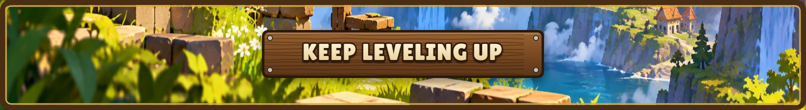
  Thanks for visiting the kingdom. ⚔️

